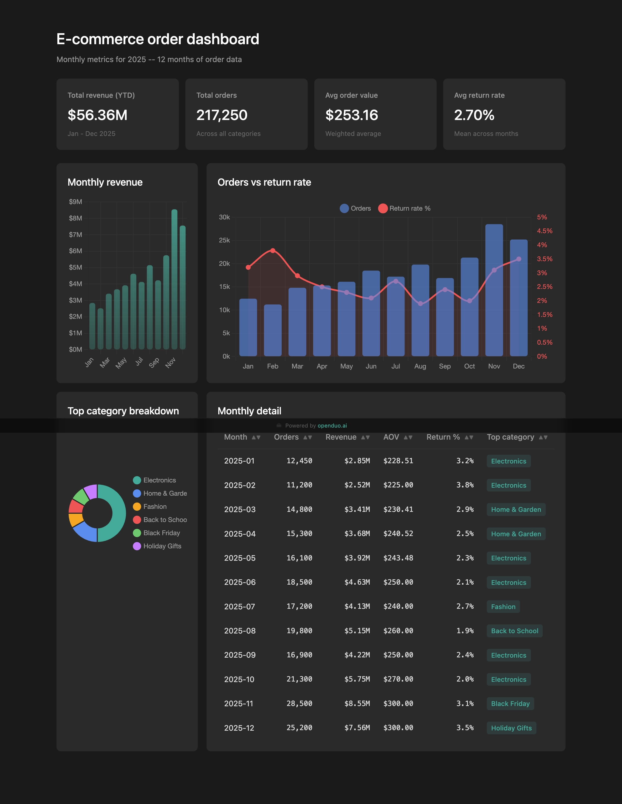
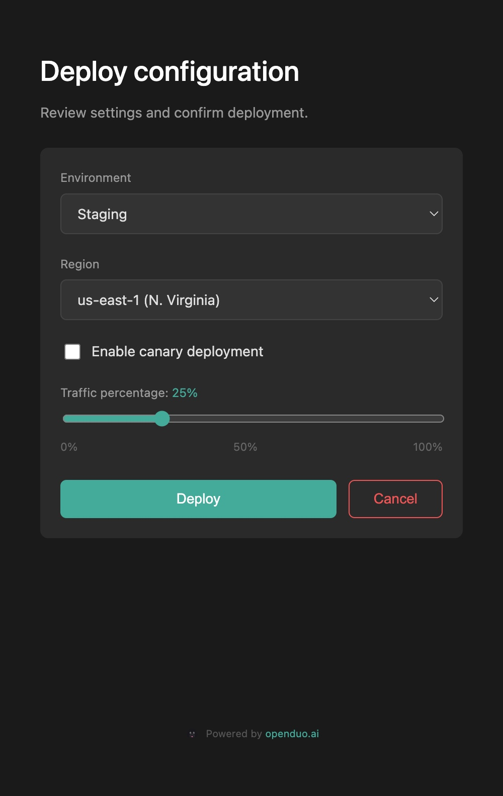
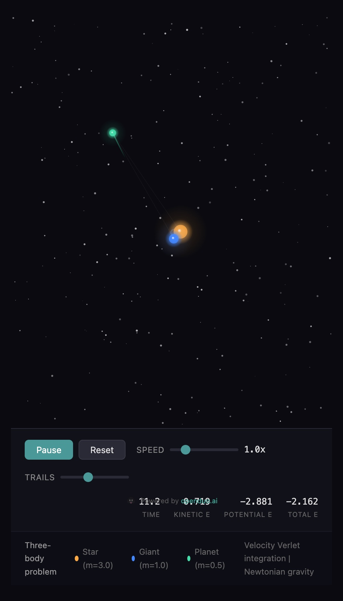
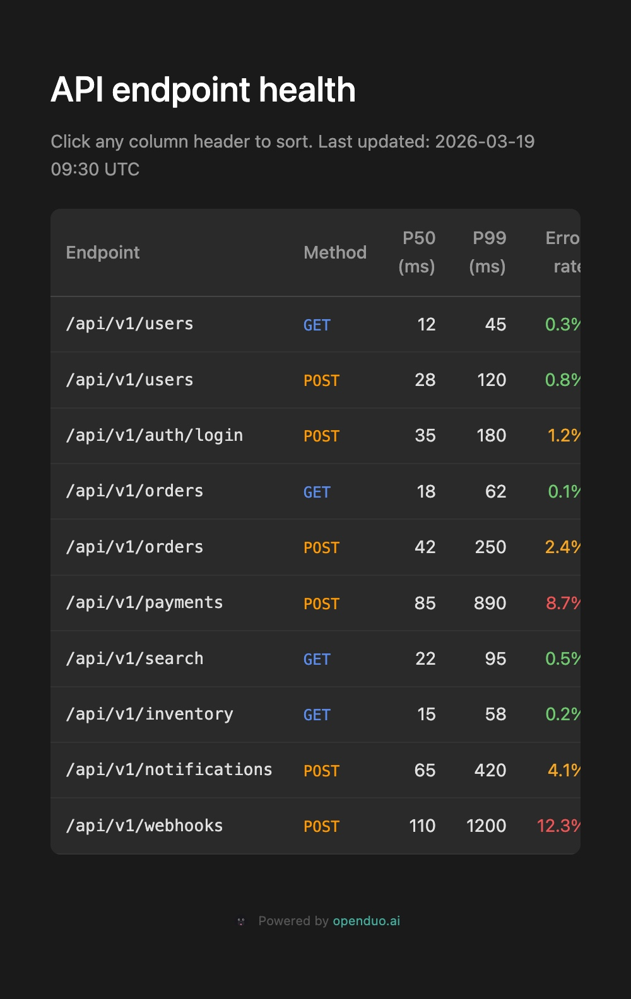
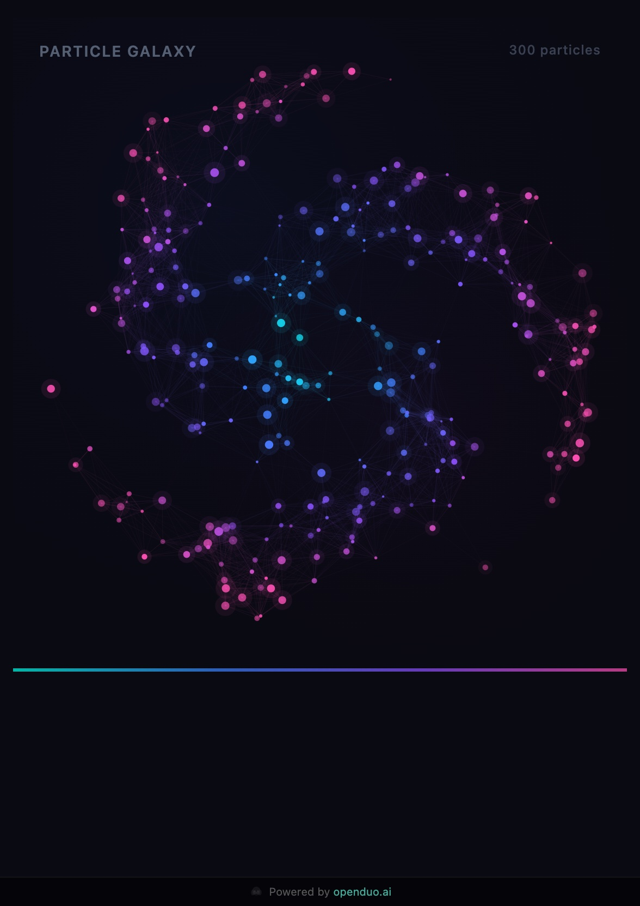
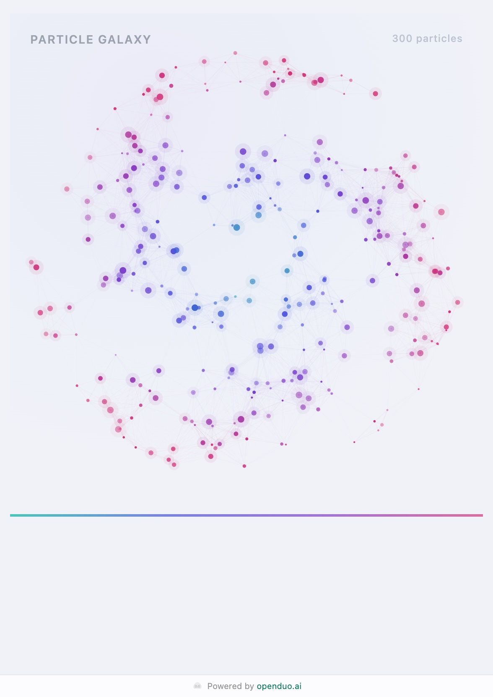

# duoduo-widget

**Interactive web widgets that give AI agents a visual voice**

## The Problem

Today's AI agents communicate through messaging — WhatsApp, Slack, Feishu, Telegram. Text works for conversation, but falls short when the agent needs to present non-linear information: a dashboard with live charts, a form that collects structured parameters, a simulation the user can interact with.

IM channels are inherently linear and text-first. When an agent needs to show a data table, collect a multi-field confirmation, or render a visualization, it's stuck formatting markdown in a chat bubble — losing context, interactivity, and clarity.

## The Solution

`duoduo-widget` gives agents the ability to create **durable, shareable, interactive web pages** through a simple CLI. The agent generates a widget, sends a URL to the user in any channel, and the user opens it in a browser to see rich, interactive content. When the user interacts — submits a form, confirms parameters, makes a selection — the agent reads the structured result as JSON.

```text
Agent creates widget  ->  User opens URL  ->  User interacts  ->  Agent reads result
     (any channel)         (any browser)      (forms, buttons)     (structured JSON)
```

This creates **richer shared context** between AI and humans — going beyond the limitations of linear chat.

## Gallery

Click any screenshot to try it live on [aidgets.dev](https://aidgets.dev):

<table>
  <tr>
    <td align="center"><a href="https://aidgets.dev/w/wid_666c12dac6864b7486a1/rev_0001"></a><br /><sub><a href="https://aidgets.dev/w/wid_666c12dac6864b7486a1/rev_0001">SQL dashboard — try live</a></sub></td>
    <td align="center"><a href="https://aidgets.dev/w/wid_d2ad001a810c4687ae14/rev_0001"></a><br /><sub><a href="https://aidgets.dev/w/wid_d2ad001a810c4687ae14/rev_0001">Interactive form — try live</a></sub></td>
  </tr>
  <tr>
    <td align="center"><a href="https://aidgets.dev/w/wid_768de09b5e324aaa92a4/rev_0001"></a><br /><sub><a href="https://aidgets.dev/w/wid_768de09b5e324aaa92a4/rev_0001">Canvas animation — try live</a></sub></td>
    <td align="center"><br /><sub>Sortable data table</sub></td>
  </tr>
  <tr>
    <td align="center"><br /><sub>Dark theme</sub></td>
    <td align="center"><br /><sub>Light theme</sub></td>
  </tr>
</table>

## Quick Start

```bash
# Install the CLI
npm install -g @openduo/duoduo-widgets
```

The default service is hosted at `https://aidgets.dev` — no setup needed.

```bash
# Set service URL
export WIDGET_SERVICE_URL=https://aidgets.dev

# Create a widget
duoduo-widget open --title "My Dashboard" --ttl-seconds 300

# Push HTML content (the user sees live updates via SSE)
echo '<h1>Hello World</h1>' | duoduo-widget update --wid "wid_..."

# Finalize — freezes as a permanent, shareable artifact
duoduo-widget finalize --wid "wid_..."
```

Send the `viewer_url` to the user through any channel. **Never share the `control_url` or `control_token`.**

## Incremental Patch Mode

Instead of re-sending the entire HTML on every update, agents can send targeted DOM patches — appending rows, updating numbers, changing status text — with minimal data transfer. The viewer applies patches instantly via CSS selectors, bypassing full-page morphdom diffing.

```bash
# 1. Push skeleton with id-tagged elements
echo '<div><h1>Dashboard</h1>
  <span id="count">0</span> items
  <tbody id="rows"></tbody>
  <div id="status">Loading...</div>
</div>' | duoduo-widget update --wid "wid_..."

# 2. Stream incremental patches (viewer updates instantly)
duoduo-widget update --wid "wid_..." --patch '[
  {"op":"append","selector":"#rows","html":"<tr><td>Acme</td><td>$120k</td></tr>"},
  {"op":"text","selector":"#count","text":"1"},
  {"op":"innerHTML","selector":"#status","html":"<strong style=\"color:green\">Done</strong>"}
]'
```

**Supported operations:**

| Op          | What it does                | Field  |
| ----------- | --------------------------- | ------ |
| `append`    | Insert HTML as last child   | `html` |
| `prepend`   | Insert HTML as first child  | `html` |
| `replace`   | Replace the matched element | `html` |
| `innerHTML` | Set innerHTML               | `html` |
| `text`      | Set textContent             | `text` |
| `remove`    | Remove the matched element  | —      |

**Why this matters**: For data-heavy widgets (tables, dashboards, reports), patch mode reduces SSE payload from O(full page) to O(delta). In benchmarks, a 4-row dashboard update transferred 46% less data than full-HTML mode — and the gap widens linearly as content grows. Patches also skip morphdom diffing and script re-execution, making viewer updates nearly instantaneous.

## CLI Reference

| Command    | Purpose                       | Key Flags                                                                |
| ---------- | ----------------------------- | ------------------------------------------------------------------------ |
| `open`     | Create a new widget draft     | `--title`, `--ttl-seconds`, `--interaction-mode`, `--interaction-prompt` |
| `update`   | Push HTML or patches          | `--wid`, `--html` or stdin, `--patch <json>`, `--text-fallback`          |
| `finalize` | Freeze as immutable revision  | `--wid`                                                                  |
| `wait`     | Block until user submits      | `--wid`, `--timeout-seconds`                                             |
| `get`      | Non-blocking submission check | `--wid`                                                                  |
| `inspect`  | Debug widget state            | `--wid`                                                                  |

`--wid` uses a local cache (`~/.cache/duoduo-widget/`) to resolve control URLs, keeping agent context clean.

## Interactive Widgets

Collect structured input from users:

```bash
# Create with interaction mode
duoduo-widget open --title "Confirm Deploy" --ttl-seconds 300 \
  --interaction-mode submit --interaction-prompt "Review and confirm"

# Push HTML with a submit button
cat <<'HTML' | duoduo-widget update --wid "wid_..."
<button onclick="window.duoduo.submit('deploy', {
  env: 'production', confirmed: true
})">Deploy</button>
HTML

# Finalize, then wait for user response
duoduo-widget finalize --wid "wid_..."
duoduo-widget wait --wid "wid_..." --timeout-seconds 300
```

Returns:

```json
{
  "submitted": true,
  "event": { "action": "deploy", "payload": { "env": "production", "confirmed": true } }
}
```

## Self-Hosting

Deploy your own widget service on Cloudflare Workers. You need a Cloudflare account with Workers Paid plan (required for Durable Objects).

### Step 1: Login to Cloudflare

```bash
npx wrangler login
```

### Step 2: Create an R2 bucket

```bash
npx wrangler r2 bucket create duoduo-widgets
```

### Step 3: Configure your account

Create `service/.env` with your Cloudflare Account ID:

```bash
cp service/.env.example service/.env
# Edit service/.env and fill in your Account ID
```

```env
CLOUDFLARE_ACCOUNT_ID=your-account-id
```

> **Where to find your Account ID**: Cloudflare Dashboard → Workers & Pages → right sidebar → "Account ID".

This file is gitignored — your credentials never get committed.

### Step 4: Set the token signing secret

```bash
cd service
npx wrangler secret put TOKEN_SECRET
# Enter a random string (e.g.: openssl rand -hex 32)
```

### Step 5: Deploy

```bash
cd service
npm install
npx wrangler deploy
```

Your service is now live at `https://duoduo-widget.<your-subdomain>.workers.dev`.

### Step 6: Custom domain (optional)

If you have a domain managed by Cloudflare DNS:

1. Go to **Workers & Pages** → your worker → **Settings** → **Domains & Routes**
2. Click **Add** → **Custom Domain**
3. Enter your domain (e.g. `widgets.yourdomain.com`)

Cloudflare handles DNS records and SSL certificates automatically.

### Step 7: Point CLI to your instance

```bash
export WIDGET_SERVICE_URL=https://widgets.yourdomain.com
# Or use the default workers.dev URL:
export WIDGET_SERVICE_URL=https://duoduo-widget.your-subdomain.workers.dev
```

### Configuration files

| File                    | Committed | Purpose                                                 |
| ----------------------- | --------- | ------------------------------------------------------- |
| `service/wrangler.toml` | Yes       | Shared config (DO bindings, migrations, R2 bucket name) |
| `service/.env`          | **No**    | Your `CLOUDFLARE_ACCOUNT_ID` (gitignored)               |
| `service/.env.example`  | Yes       | Template for `service/.env`                             |
| `service/.dev.vars`     | **No**    | Local dev secrets for `wrangler dev` (gitignored)       |
| `.env`                  | **No**    | CLI config: `WIDGET_SERVICE_URL` (gitignored)           |
| `.env.example`          | Yes       | Template for `.env`                                     |

## Architecture

```text
Agent -> duoduo-widget CLI -> Widget Service (Cloudflare Workers)
                                  |
                     +------------+------------+
                     |            |            |
                  Workers      Durable       R2
                 (routing)    Objects      (storage)
                     |       (state)         |
                     |            |            |
                     +-----+------+-----+-----+
                           |            |
                        Viewer      Immutable
                        (SSE)      Revisions
```

- **CLI**: Node.js binary, talks to the service over HTTPS
- **Workers**: API routing + viewer shell serving
- **Durable Objects**: Draft coordination, wait/get blocking, submit idempotency
- **R2**: Immutable revision storage (finalized HTML persists permanently)
- **Viewer Shell**: Sandboxed HTML with morphdom progressive updates, incremental DOM patching, SSE streaming, `window.duoduo` bridge

## Agent Skill

For Claude Code / AI agent integration, see [`skill/interactive-widget/SKILL.md`](./skill/interactive-widget/SKILL.md). The skill teaches agents when and how to use widgets — progressive generation patterns, interaction handling, HTML component patterns, and security guidelines.

Install as a Claude Code skill:

```bash
ln -s /path/to/duoduo-widgets/skill/interactive-widget ~/.claude/skills/interactive-widget
```

## Design Document

For the full design rationale, architecture decisions, state machine specification, and protocol details, see [`docs/design/widgets.md`](./docs/design/widgets.md).

## License

[MIT](./LICENSE)

---

<p align="center">Built with care by <a href="https://openduo.ai">OpenDuo</a></p>
